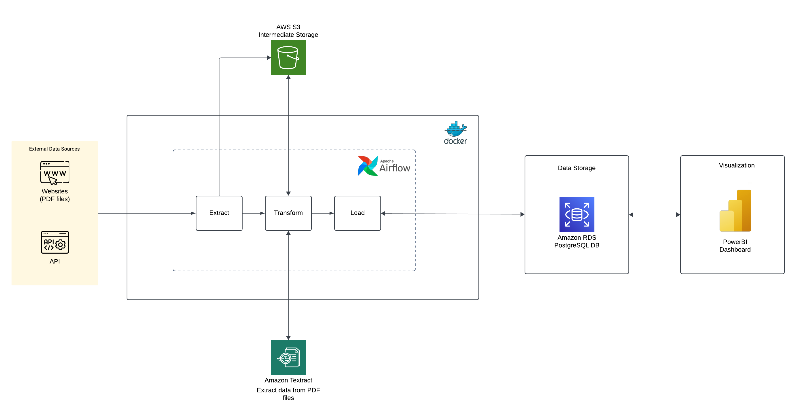
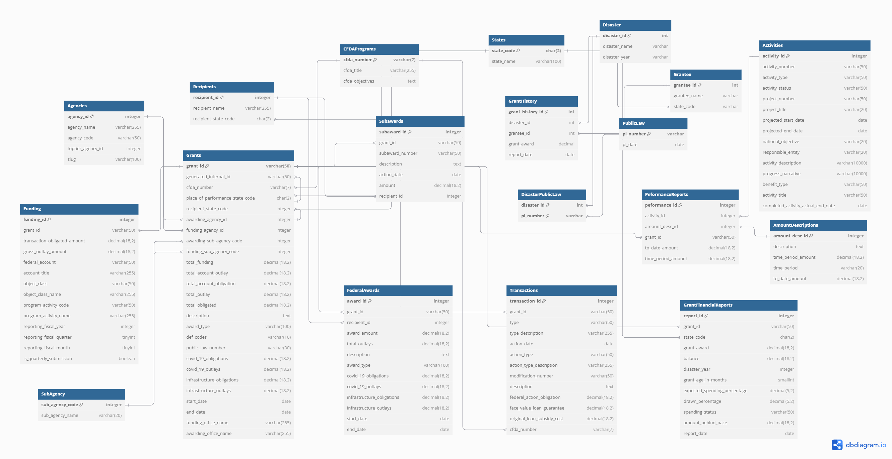

# Federal Spending Tracking Tool 🚀

The Federal Spending Tracker Tool is designed to automate the extraction, transformation, and loading (ETL) of data related to federal spending, with a focus on housing programs in Puerto Rico. This document provides an overview of the tool's architecture, detailed procedural guidelines, and instructions for running the ETL pipelines.
The system employs AWS services for data storage and processing, Apache Airflow for workflow orchestration, and AWS RDS PostgreSQL for data storage. The pipelines are intended to handle data from multiple sources, including PDFs, APIs, and manually uploaded documents.


---

## 🌟 **Project Highlights**
- **Four Dynamic ETL Pipelines:** Tailored for financial reports, historical data, USA spending data, and quarterly performance metrics.
- **AWS-Powered Workflows:** Utilize S3 for storage, Textract for PDF data extraction, and RDS PostgreSQL for data warehousing.
- **Orchestrated with Apache Airflow:** Simplify scheduling, monitoring, and error handling across all pipelines.
- **Containerized with Docker Compose:** Seamless deployment and management of the ETL pipelines.
- **Comprehensive Data Processing:** Transform raw data into a structured format ready for analysis.

---

## 🏢 **System Architecture**



*This diagram provides an overview of the system architecture, showcasing the flow of data from extraction to storage in PostgreSQL.*

---

## 🔋 **Data Schema Overview**



*This diagram outlines the relational schema used in the AWS RDS PostgreSQL database, including tables for financial reports, historical data, and more.*

---

## 🗂️ **Project Overview**

### **Pipeline 1: Financial Reports Extraction**
- **Extract:** Scrape financial PDFs via `web_scraper.py` and store in S3 (`raw` bucket).
- **Transform:** Use AWS Textract (`financial_reports_processing_script.py`) to process PDFs into structured data stored in the `processed` bucket.
- **Load:** Save the processed data into PostgreSQL tables using `financial_reports_data_ingestion.py`.

### **Pipeline 2: History Reports Extraction**
- **Extract:** Scrape historical data PDFs via `web_scraper.py` into S3 (`raw` bucket).
- **Transform:** Process the PDFs with AWS Textract (`history_reports_processing_script.py`) and save results in the `processed` bucket.
- **Load:** Store the processed data in PostgreSQL using `history_reports_data_ingestion.py`.

### **Pipeline 3: USA Spending Data Extraction**
- **Extract:** Fetch data using APIs (`usa_spending_extraction_script.py`) and store it in S3 (`raw` bucket).
- **Transform:** Normalize and structure the data (`usa_spending_processing_script.py`) and save to the `processed` bucket.
- **Load:** Import the cleaned data into PostgreSQL using `usa_spending_data_ingestion.py`.

### **Pipeline 4: Quarterly Performance Reports**
- **Extract:** Manual upload of specific pages from quarterly PDF files to S3 (`raw` bucket).
- **Transform:** Extract and process data using Textract (`quarterly_performance_reports_processing_script.py`) and save in `processed` bucket.
- **Load:** Ingest the processed data into PostgreSQL with `quarterly_performance_reports_data_ingestion.py`.

---

## ⚙️ **Technologies Used**
- **Apache Airflow**: Orchestrates ETL workflows with easy-to-manage DAGs.
- **AWS S3**: Seamlessly handles raw and processed data storage.
- **AWS Textract**: Extracts structured data from complex PDF documents.
- **PostgreSQL**: Reliable storage for final processed data.
- **Docker Compose**: Simplifies deployment and environment setup.
- **Python**: Powers the scripts for data extraction, transformation, and ingestion.
- **PowerBI**: Intuitive and insightful analytical dashboards for clients.

---

## 🚀 Getting Started

### Prerequisites
- Python 3.8+
- Docker & Docker Compose (for running Airflow)
- AWS CLI configured with the appropriate credentials

### Installation
1. Clone the repository:
   ```bash
   git clone https://github.com/leelasagar1/federal_spending_tracking_tool.git
   cd federal_spending_tracking_tool
   ```
2. Configure AWS credentials: Update the config/aws_config.json file with your AWS details:
   ```bash
      {
         "aws_access_key_id": "REPLACE WITH AWS ACCESS KEY",
         "aws_secret_access_key": "REPLACE WITH AWS SECRET ACCESS KEY",
         "region_name": "REPLACE WITH AWS REGION"
      }
   ```
3. Set Up S3 Buckets in AWS

   Create two S3 buckets: one for raw data and one for processed data.
   
   Update the S3 configuration file (`config/S3_config.json`) with bucket details:
   
   ```json
   {
     "raw_bucket": "REPLACE WITH RAW BUCKET NAME",
     "processed_bucket": "REPLACE WITH PROCESSED BUCKET NAME"
   }
   ```
4. Set Up PostgreSQL in AWS RDS

   1. **Create a PostgreSQL instance in AWS RDS:**
      - Go to **RDS** > **Create Database** in AWS Console.
      - Select **PostgreSQL** as the engine.
      - Configure:
      - **Engine Version**: PostgreSQL 14+
      - **Username**: `admin` (or your choice)
      - **Database Name**: `federal_spending_db`
      - Enable Public Access (for local testing).
      - Save the **Endpoint**, **Username**, and **Password**.

   2. **Create the database schema**:
      Connect to your RDS instance:
      ```bash
      psql -h <RDS_ENDPOINT> -U <USERNAME> -d postgres
      ```
      Create the database:
      ```sql
      CREATE DATABASE federal_spending_db;
      ```

   3. **Run the Table Creation Script**:
      Use the SQL script in the `db_queries` folder to create tables:
      ```bash
      psql -h <RDS_ENDPOINT> -U <USERNAME> -d federal_spending_db -f db_queries/create_tables.sql
      ```
4. Set Up Apache Airflow Using Docker Compose

   Run the following commands to set up Apache Airflow:

   a. **First-time setup commands for Apache Airflow:**
   
      ```bash
      docker-compose up airflow-init
      ```
   
   b. **Start all services:**
   
      ```bash
      docker-compose up -d
      ```
   
   c. **To shut down the Airflow server and stop all containers:**
   
      ```bash
      docker-compose down
      ```
### Running the Pipelines
- To trigger the pipelines manually, go to the Airflow web UI (usually accessible at `http://localhost:8080`) and enable the DAGs as needed.


## 📂 **Project Structure**
```
code
├── dags                  # Airflow and related scripts
│   ├── config            # configurations
│   │   ├── aws_config.json   # AWS credentials configuration
│   │   └── S3_config.json    # S3 bucket configuration
│   ├── data_extraction   # Scripts for data extraction
│   │   ├── usa_spending_extraction_script.py
│   │   └── web_scraper.py
│   ├── data_ingestion    # Scripts for data ingestion
│   │   ├── financial_reports_data_ingestion.py
│   │   ├── history_reports_data_ingestion.py
│   │   ├── quarterly_performance_reports_data_ingestion.py
│   │   └── usa_spending_data_ingestion.py
│   ├── data_processing   # Scripts for data processing
│   │   ├── financial_reports_processing_script.py
│   │   ├── history_reports_processing_script.py
│   │   ├── quarterly_performance_reports_processing_script.py
│   │   └── usa_spending_processing_script.py
│   ├── helpers           # Utility helper scripts
│   │   ├── aws_utils.py
│   │   ├── date_extractor.py
│   │   ├── db_utils.py
│   │   └── utils.py
│   ├── financial_reports_dag.py
│   ├── history_reports_dag.py
│   ├── quarterly_perfromance_report_dag.py
│   └── usa_spending_dag.py
│           
├── Dockerfile        # Dockerfile for containerization
└── docker-compose.yaml

├── db_queries            # SQL scripts for database setup
│   └── create_tables.sql

├── documentation         # Project documentation
│   └── Procedures Document.docx

├── images                # Architecture and schema diagrams
│   ├── Project_database_schema.png
│   └── project_architecture_diagram.png

├── PowerBI dashboard                # Analytical dashboard for clients
│   ├── Federal Spending Tracker dashboard.pbix

├── .gitignore            # Git ignore file
└── README.md             # Project README file
```


## Data Flow
1. **Extraction**: Raw data is fetched from web pages, APIs, or manually uploaded PDFs.
2. **Transformation**: Data is extracted from PDF files using AWS Textract and processed for consistency.
3. **Loading**: The transformed data is saved in AWS RDS PostgreSQL tables for downstream use.

## Key Considerations
- **Manual Steps**: For sources that require manual intervention, manual work is needed to upload specific pages to the S3 bucket.
- **Data Quality**: Ensure data quality checks are performed during processing to maintain consistency.

## Future Enhancements
- Automate the manual step in Pipeline 4 using an OCR script to reduce human intervention.
- Add monitoring and alerting for pipeline failures.

